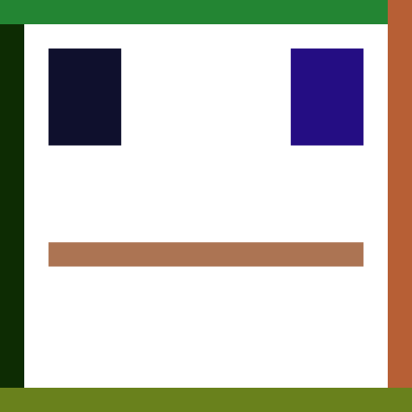

# Faceless Bytecode

<p align="center">
	
</p>

NFT collection that uses custom bytecode generated contracts for storing SVG data on-chain.
The contracts that hold the SVG data contain hexadecimal strings as their own deployed bytecode.

Since the contract bytecode does not contain all the normal clutter the gas used for deployment is reduced.
This method allows to deploy almost 24 KB full SVG strings using less gas than storing the SVG data on an immutable variable.

## bytecode

Simple bytecode generator used for the SVG data.
The contract deployment apart from the hex string only contains between 13 to 15 bytes of bytecode clutter.

## Gas deployment differences

As seen on the `hardhat/scripts/deploy-svg-compare.js` script;
For a 650 B SVG (1.27 KB when hex encoded) the results are the following (Ganache local node):

```
Gas for raw bytecode 190286
Gas for contract with data 654925 (344%)
```
